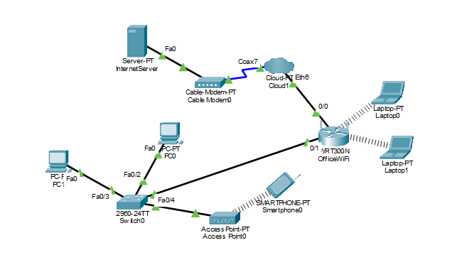

# Wireless Network Setup and Security Configuration Using Cisco Packet Tracer

## Overview

This repository covers the design, configuration, and testing of a small-office wireless network built in Cisco Packet Tracer. The network provides secure WPA2-encrypted Wi-Fi for employees, a separate Wi-Fi network for guests, automatic IP addressing via DHCP, and working internet connectivity for all users, along with a wireless troubleshooting exercise.

## Network Topology

## What's included

| File | Description |
|---|---|
| `wireless-network-setup-security-configuration.pkt` | Cisco Packet Tracer project file — open and simulate the full network topology |
| `Wireless_Network_Setup_and_Security_Configuration.docx` | Full written report (Word document) with configuration steps, screenshots, and testing results |

## Network summary

- **Router:** Linksys WRT300N, hostname `OfficeWiFi`, LAN `192.168.10.1/24`
- **Employee Wi-Fi:** SSID `StaffNet`, WPA2-PSK, DHCP range `192.168.10.100–150`
- **Guest Wi-Fi:** SSID `GuestNet` on a secondary access point, WPA2-PSK, same shared DHCP scope
- **Devices:** 2 wired PCs, 2 wireless laptops (StaffNet), 1 wireless smartphone (GuestNet)
- **Internet simulation:** Cloud + Cable Modem + external server, reachable from all three network segments
- **Troubleshooting task:** A laptop failing to connect (wrong SSID/passphrase) diagnosed and fixed

## How to open

1. Install [Cisco Packet Tracer](https://www.netacad.com/courses/packet-tracer) (free with a Cisco Networking Academy account).
2. Open the `.pkt` file to view and simulate the topology.
3. Refer to the `.docx` report for step-by-step configuration details, screenshots, and connectivity test results.
